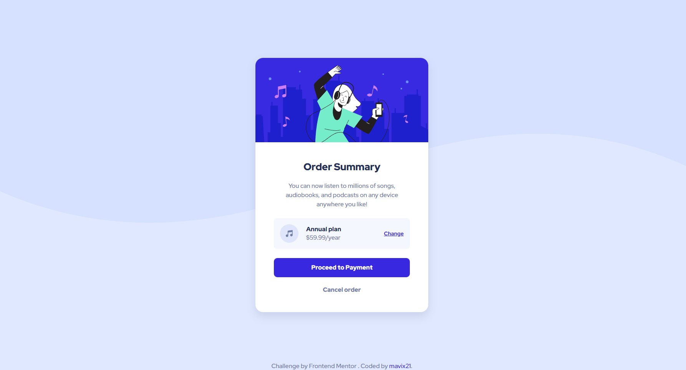

# Frontend Mentor - Order summary card solution

This is a solution to the [Order summary card challenge on Frontend Mentor](https://www.frontendmentor.io/challenges/order-summary-component-QlPmajDUj). Frontend Mentor challenges help you improve your coding skills by building realistic projects.

## Table of contents

- [Overview](#overview)
  - [The challenge](#the-challenge)
  - [Screenshot](#screenshot)
  - [Links](#links)
- [My process](#my-process)
  - [Built with](#built-with)
  - [What I learned](#what-i-learned)
  - [Continued development](#continued-development)
  - [Useful resources](#useful-resources)
- [Author](#author)

**Note: Delete this note and update the table of contents based on what sections you keep.**

## Overview

### The challenge

Users should be able to:

- See hover states for interactive elements

### Screenshot

### Links

- Solution URL: <a href="https://www.frontendmentor.io/solutions/product-preview-card-component-using-sass-bem-and-itcss-JQif41HVUx" target="_blank">My solution at frontendmentor.io</a>
- Live Site URL: <a href="https://order-summary-component-mavix.netlify.app/" target="_blank" rel="noopener">Click here to see my solution in your browser!</a>

## My process

### Built with

- SASS
- BEM
- Semantic HTML5 markup
- CSS custom properties
- Flexbox
- CSS Grid
- Mobile-first workflow
- ITCSS

### What I learned

For this project I wanted to use SASS because I love to keep my code organized and SASS allows me to do that. I know it's a little bit of an overkill, but I would like to get use to it since the very beginning.

I also wanted to implement the ITCSS architecture because I think it makes CSS code mode readible and maintainable. So you will see that I organized all my sass files inside the sass folder. For those who are not familiar with the ITCSS structure, I'm going to briefly explain what you can find inside each folder:

- [abstracts]: Basically all the content that will not render to actual CSS code, such as custom properties, functions, mixins, etc.

- [generic]: Reset and/or Normalize styles (I use both). This is the first layer that will generate actual CSS.

- [elements]: The basic styling for HTML elements (like H1, a, img). Think about how your site would look without classes.

- [objects]: This is the first layer where we include classes. This classes define undecorate desing pattern, for example, layout related classes. Think of this as more architectural code.

- [components]: This is where most of our work takes place. Here we will find the specific UI components.

### Continued development

I really want to dig more into SASS, so I will keep using it in my future projects.

### Useful resources

- [ITCSS Architecture](https://www.xfive.co/blog/itcss-scalable-maintainable-css-architecture/) - You can read more about ITCSS architecture here.

## Author

- Frontend Mentor - [@mavix21](https://www.frontendmentor.io/profile/mavix21)
